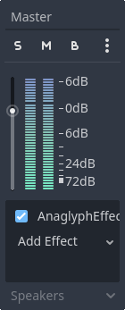
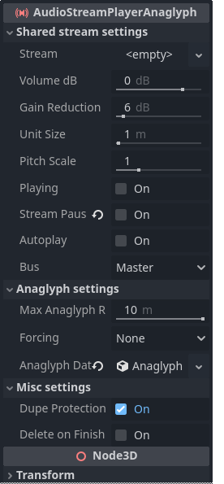
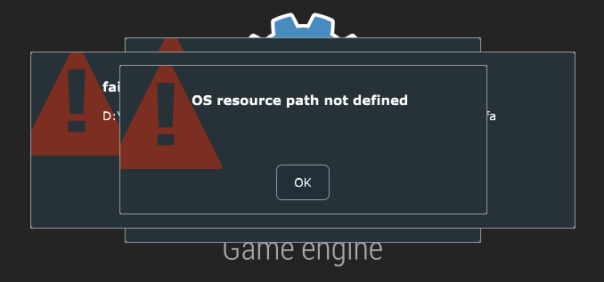

GDAnaglyph
==========
This is an **unofficial** port of the binaural plugin [Anaglyph](http://anaglyph.dalembert.upmc.fr/) into the Godot engine.

> [!WARNING]
> This repo is currently fairly brittle ("*experimental*"), and **Windows-only**.  
> Please read this file (especially the "Limitations and known issues" section) carefully before doing anything.

[Anaglyph](http://anaglyph.dalembert.upmc.fr/) is an audio effect that uses the [head-related transfer function](https://en.wikipedia.org/wiki/HRTF) to make sound more realistic. While panning on its own can achieve quite a lot already, the HRTF does much more processing that can be summarized as "take into account the shape of the ear, and its influence".  
This audio processing is specifically tailored to ear- and headphone users. Other kinds of speaker will sound off.

Preview (youtube video, click the image or [this url](http://www.youtube.com/watch?v=ekFmhZ6iv3Y)):  
[](http://www.youtube.com/watch?v=ekFmhZ6iv3Y "Anaglyph VST in Godot")

This demo has five sound sources:
- A pretty old, low-quality radio;
- An overhead lamp swinging to and fro;
- Knocking on a door;
- Footsteps when you're walking; and
- The outside wind.

Getting started
===============
To get started, go to the [releases](https://github.com/Atrufulgium/GDAnaglyph/releases) and grab the one you need:
1. The `demo-windows-v0.1.zip` file contains the full sample project, including all assets.
2. The `gdanaglyph-v0.1.zip` file contains just the basic resources, and can be merged into a new or existing project.

`demo-windows-v0.1.zip`
-----------------------
This one is as simple as unzipping the file, and opening the project in Godot. (Either just select the folder in the startup window, or `godot project.godot` from the command-line if you Godot lives in your path.)

The organization of the demo project is pretty ad-hoc and hacked together, but the points of interest are the various `AudioStreamPlayerAnaglyph`s in the `room.tscn` scene:
- In the hierarchy, `Room/Audio/Knock` contains a script [`res://scenes/room/audio_spawner.gd`](./demo/scenes/room/audio_spawner.gd) that randomly spawns in an audio source.
- `Room/Audio/Wind` has a "vanilla" `AudioStreamPlayerAnaglyph` looping a wind sound.
- `Room/RoomMeshes/old radio/AudioStreamPlayerAnaglyph` contains the [`res://scenes/room/radio.gd`](./demo/scenes/room/radio.gd) extension of `AudioStreamPlayerAnaglyph`. The only thing this extension does is start the stream at a non-zero offset.
- `Room/lamp2/Cylinder/lamp/AudioStreamPlayerAnaglyph` is a "vanilla" `AudioStreamPlayerAnaglyph` looping a creaking sound. This sound is moved around by one of its parents.
- `Player` has `LeftFoot` and `RightFoot` children that make the footstep noises with the [`res://scenes/room/player.gd`](demo/scenes/room/player.gd) script.

Feel free to just play around in here!

`gdanaglyph-v0.1.zip`
---------------------
To put GDAnaglyph into a new or existing project, the `Anaglyph` and `bin` folders inside the zip have to be merged into your project folder (so that you have folders `res://Anaglyph` and `res://bin` in your project). If Godot was open, restart it.

You can verify installation was successful by adding the `AnaglyphEffect` bus effect to master, playing some sound on loop, and playing around with the positional parameters. (Don't forget to wear headphones!)

A quick tour
------------
### The *AnaglyphEffect* bus effect

Now that you're set up, let's quickly go over what this plugin has to offer.

The main thing is a new bus effect, the *AnaglyphEffect*. This is a near-1:1 bridge to the [original](http://anaglyph.dalembert.upmc.fr/) (this page also contains a more technical description of the effect). If you're of the musical kind, I'd recommend playing around with the VST version in your DAW of choice!

The effect exposes the following parameters categorized into the following sections:
- **Binaural Personalisation**. Here you specify the parameters of what kind of "3D-ness" your sound has. What model you choose impacts how the listener's ears will interpret the sound as being in 3D space, especially if you use custom models.
- **Localisation**. Here are some extra hints to help the listener's ears.
- **Attenuation**. Exposes settings that have to do with how the sound decays over distance. (Note that these settings are quite different from Godot's `AudioStreamPlayer3D`!)
- **Reverb**. Here you can mess around with the reverb.
- **Position**. The position of the audio source in 3D space, specified in spherical coordinates.

See the documentation in the editor for much more detail for each individual parameter. (Or, if you like reading raw xml, [just read it in the repo](./doc_classes/AnaglyphEffect.xml).)

> [!NOTE]  
> As the *Position* section implies, this effect works best for **point audio sources**. Dry, mono sound effects that come from a single point in space.  
> If your sound has reverb already applied to it or otherwise comes from "multiple directions" already, results may vary.

> [!NOTE]  
> Anaglyph needs a bit of time to load the model. This takes about a second. Before this, the sound will be played as if the `Wet` value is at 0%. Once it's loaded, it will automatically switch to binaural sound. This difference can be jarring -- you may want to prepare these bus effects some time before you use them.

### The *AudioStreamPlayerAnaglyph* node
Having to manually add this effect to buses, and setting positions properly, is somewhat annoying. To help with this, there is also the *AudioStreamPlayerAnaglyph* node.


This node actually consists of three nodes. Whenever you introduce an AudioStreamPlayerAnaglyph into the tree, it adds two children:

- An `AudioStreamPlayer` "Anaglyph AudioStream", which will be used to play the sound in binaural fashion, if possible; and
- An `AudioStreamPlayer3D` "Fallback AudioStream", which will be used to play the sound ordinarily.

> [!NOTE]  
> This addition of children happens in the `enter_tree()` phase. Do not expect these to exist before then.

This fallback is *required*. Anaglyph can be/should be unavailable in a variety of circumstances:
- The Anaglyph dll is missing or otherwise fails to load;
- The sound source is too far away;
- All internal Anaglyph buses are in use (more in this below);
- The user is not wearing headphones;
- The user may simply not want binaural audio.

Many of the settings between these two children are shared. This gives the **Shared stream settings** section in the node.

> [!WARNING]  
> All properties exposed under **Shared stream settings** should not be edited in the children, for this node will overwrite their values. Most other values in the children can be edited freely (`mix_target`, `max_polyphony`, and `playback_type` are ignored).

Beyond this, you can also set the AnaglyphEffect settings **Anaglyph settings**, and there are some miscellaneous settings in **Misc Settings**. Again, see the documentation in the editor for more information.

These nodes automatically handle the internal Anaglyph buses, and automatically set the correct positional values based on the camera position.

> [!WARNING]  
> Unlike `AudioStreamPlayer3D`, this node does not support `AudioListener3D`. Do not use `AudioListener3D` and `AudioStreamPlayerAnaglyph` in the same scene.

Anaglyph can be somewhat expensive, so the amount of available buses is limited by default. There are some static methods that interact with these buses directly.

```gdscript
# Prints `4` by default
print(AudioStreamPlayerAnaglyph.get_max_anaglyph_buses())

# We know what we're doing, we chose inexpensive reverb,
# we can use some more buses without ruining performance.
AudioStreamPlayerAnaglyph.set_max_anaglyph_buses(8)

# We want to prepare the effects to be ready, instead of
# a sudden switch during an audio clip.
# WIth this, we ensure all eight buses are prepared.
AudioStreamPlayerAnaglyph.prepare_anaglyph_buses(8)
```

All methods you'd usually expect an `AudioStreamPlayer` to have are available: `play()`, `seek()`, etc. The `finished` signal is also available.

Finally, if you want to play some sound without going through the effort of creating nodes yourself, there is also the static `AudioStreamPlayerAnaglyph.play_oneshot(..)` method. This method is fairly limited (as you can't have moving audio sources with this, for instance).

Limitations and known issues
============================
This is currently windows-only
------------------------------
This is a little stupid, but I only have a Windows machine, so I can't build a bridge to the macOS version made available on Anaglyph's homepage.  
If someone would like to help with this, I'd appreciate it!

What needs to be done is "simple", namely fill in the `Create()`, `Release()`, etc. methods from `static UnityAudioEffectDefinition* GetEffectData()`'s return value as described in `src/anaglyph_dll_bridge.h`. Unfortunately, my knowledge of mac's equivalent of dlls is nada.

I get some weird pop-ups!
-------------------------
Anaglyph uses their own UI to display error messages, and you may see something like the following:



As far as I know, this only happens when your folder structure is malformed. On Windows, Anaglyph requires the following structure:
```
res://Anaglyph
 |- audioplugin_Anaglyph.dll
 |- .DS_Store
 '- anaglyph_plugin_data
    |- .DS_Store
    '- (all .sofa files)
```
If you get this error in-editor, please double-check the file structure inside `res://Anaglyph` is the same as in `gdanaglyph-v0.1.zip`'s `Anaglyph` folder. If you don't get this error in-editor, but your *exported* games get this error, I've messed up (the `anaglyph_export_plugin.h` and `anaglyph_export_plugin.cpp` files are made to handle this) and you should make an issue.

Godot just crashes on start-up!
-------------------------------
I know the dll *very occasionally* crashes on start-up in Unity when reading `UnityAudioParameterDefinition* UnityAudioEffectDefinition.paramdefs`, but I don't read that in this Godot version -- I hardcoded all parameters. If you still get a crash, definitely let me know!

I can't use the `Play` property of `AudioStreamPlayerAnaglyph`!
---------------------------------------------------------------
I'm a bit conflicted about this one -- it would require spawning and then cleaning up a bunch of buses in the editor, and I just haven't found a way that I deem "not messy". Not to say anything of how it depends on the camera position -- but which camera? The scene viewer's camera is somewhat awkward, but you also don't want to have to move the main camera around just to hear your sound in the editor.

If you know of an elegant solution, let me know or implement it yourself!

My `AudioListener3D` does not do anything!
------------------------------------------
The neat approach [`AudioStreamPlayer3D` uses](https://github.com/godotengine/godot/blob/e7c39efdb15eaaeb133ed8d0ff0ba0891f8ca676/scene/3d/audio_stream_player_3d.cpp#L378) is not exposed in `godot-cpp`, which I rely on. The only alternative is to manually walk through all nodes to determine what position to use, but that's *slow*.

So, currently `AudioListener3D` and `AudioStreamPlayerAnaglyph` should just not be used in the same scene.

My buses keep running out!
--------------------------
If you remove an `AudioStreamPlayerAnaglyph` from the hierarchy (whether with `remove_child()`, or with `free()`), it will still keep hogging a bus, and count towards the maximum amount of Anaglyph buses. Please pause/stop playing beforehand.

Alternatively, your max buses count may just be low. The default is `4`, but can be changed with `AudioStreamPlayerAnaglyph.set_max_anaglyph_buses(int)`.

Changing `anaglyph_data` doesn't do anything/some `AudioStreamPlayerAnaglyph`s sounds come from the wrong place!
----------------------------------------------------------------------------------------------------------------
Duplicate `AnaglyphEffectData` resources are a problem, as they can represent the position of only *one* sound source.

By default, `AudioStreamPlayerAnaglyph` has a `dupe_protection` property (under **Misc settings**) turned on. This *copies* the effect data when playback starts, but does not update it when changes happen.

However, if `dupe_protection` is off, the `AnaglyphEffectData` will be used directly. While this allows you to change Anaglyph settings while sound is playing, if multiple players use the same resource, only one of them will have their position correct.

What about c#?
--------------
There's currently no c# bindings because I'm too lazy to recompile the entire engine so that I can follow steps [like these](https://old.reddit.com/r/godot/comments/zlglpk/is_it_possible_to_call_gdextension_code_from_c/). You'll have to build the bridge between gdscript and c# yourself, for the time being.

I got an `Anaglyph's dsp buffer size doesn't match godot's` error!
-----------------------------------------------------------------
Okay, so this is *probably* just me being an imbecile, but I just can't find where `godot-cpp` exposes the size a certain buffer needs to be. Which resulted in me just *guessing* it. It's an informed guess, but still just a guess.

If anyone can help me make `AnaglyphBridge::get_dsp_buffer_size`'s implementation to be not-as-guessworky, then by all means!

Anaglyph sounds different the first few seconds!
------------------------------------------------
Anaglyph needs a little time to warm up. If you dislike this, prepare the buses beforehand (e.g. when the game is first loading). If you're using `AudioStreamPlayerAnaglyph`, use `AudioStreamPlayerAnaglyph.prepare_anaglyph_buses(int)`.

Contributing
============
yes ples

I'm not a cpp guy, so the code in this repo is probably all kinds of *bad*. I haven't been paying much attention to memory leaks, the file definitions are all over the place, etc. etc.

To get started, you'll need this repo, `demo-windows-v0.1.zip` for the demo assets if that's where you do your testing, and the generated files from the 4.3 branch of [godot-cpp](https://github.com/godotengine/godot-cpp). (If you're as new to this as I was, [they have a tutorial for this set-up](https://docs.godotengine.org/en/stable/tutorials/scripting/gdextension/gdextension_cpp_example.html).)

The project is setup as follows:
- The Anaglyph version I use is the *Unity plugin* version. `AudioPluginInterface.h` is [this specification](https://github.com/Unity-Technologies/NativeAudioPlugins/blob/master/NativeCode/AudioPluginInterface.h) that Anaglyph's dll satisfies. Consider this file read-only.
- `anaglyph_dll_bridge.h/cpp` reads the dll in `AnaglyphBridge::GetDataFromDLL` to grab the methods specified in `AudioPluginInterface.h`. The other methods can then be used to interact with Anaglyph.
-
    `anaglyph_effect.h/cpp` is the bus effect in Godot. The data belonging to this effect is put inside `anaglyph_effect_data.h/cpp`, but I decided both should have easy getters/setters. (This does give an annoying amount of code- and even documentation-duplication...)

    Note that I'm *not* reading `UnityAudioParameterDefinition* UnityAudioEffectDefinition.paramdefs` to automatically handle the parameters. I want a more intuitive interface than a bunch of `[0,1]`-parameters.

- `audio_stream_player_anaglyph.h/cpp` is the node. Its buses are managed via `borrow_anaglyph()` and `release_anaglyph()` that refer to `anaglyph_bus_manager.h/cpp`.
- To ensure exports also have Anaglyph data in the correct place, `anaglyph_export_plugin.h/cpp` was needed.
-
    I was sick of binding `get_X` and `set_X` values to a property `X`, so that's why `register_macro.h` is a thing. There's also some helper functions in `helpers.h`.

    In particular, `AnaglyphHelpers::print()` only prints in `--verbose` mode. Either run `godot --verbose`, or run just your game and not the editor in verbose mode adding `--verbose` to `Project Settings > General > Editor > Run > Main Run Args`.

- `register_types.h/cpp` is just as in the godot-cpp tutorial listed above.

Feel free to just work on whatever -- either one of the things in the "Limitations and known issues" part above, or stuff that you yourself deem sensible.